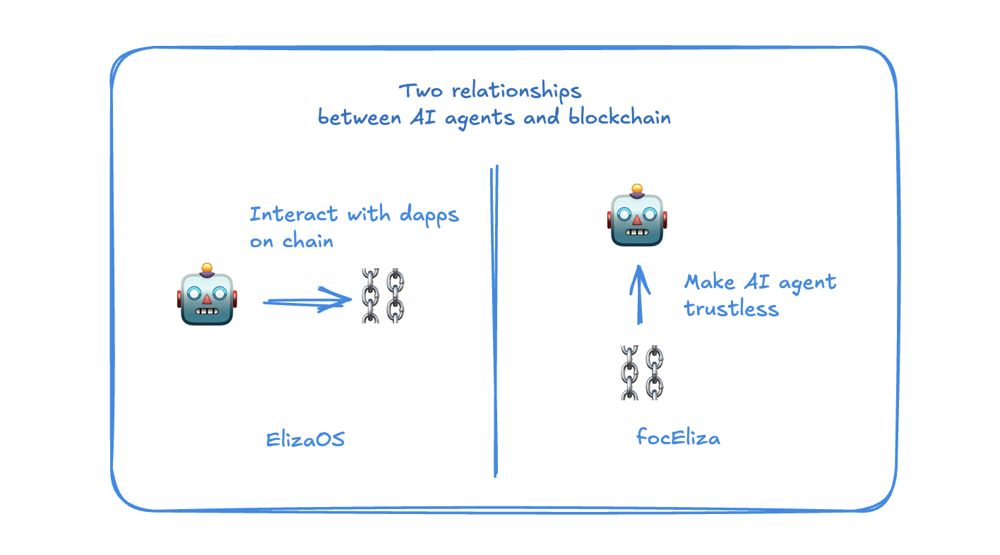
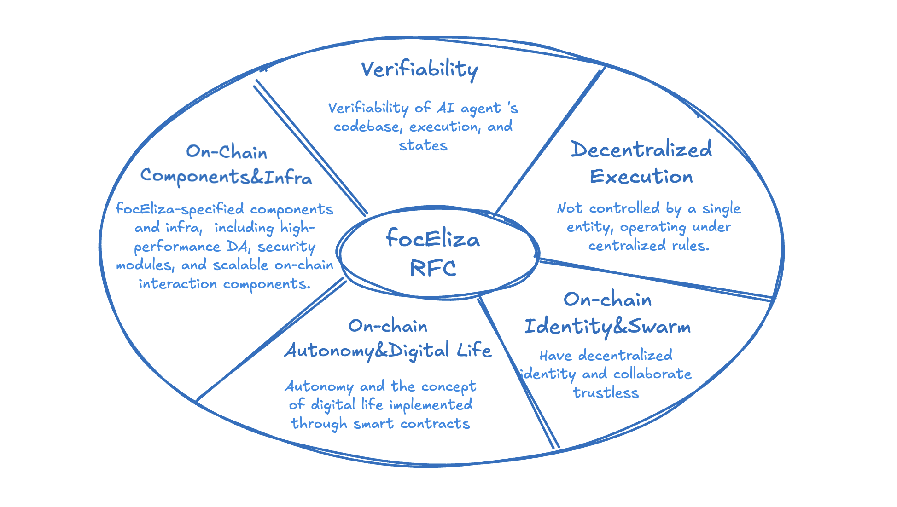

# focEliza RFC

**focEliza Request for Comments (RFC)** is a collection of concepts, protocols, programs, and standards related to Fully On-Chain ElizaOS. RFCs encourage developers, researchers, and the community to engage in discussions and propose improvements, aiming to establish widely applicable on-chain components for ElizaOS.


## Motivation

We believe that autonomous AI agents will inevitably integrate deeply with blockchain in the future. ElizaOS v1 only includes plugins for interacting with individual blockchains, providing basic capabilities to interact with blockchain-based dApps. ElizaOS v2 will natively integrate TEE (Trusted Execution Environment) and blockchain interaction modules, enabling AI agents to perform verifiable and more flexible blockchain interactions.

However, the relationship between AI agents and blockchain remains limited to AI agents calling dApp functionalities, rather than leveraging blockchain’s decentralized primitives to enhance the autonomy of AI agents and fundamentally transform their nature. Thus, the focEliza project is dedicated to achieving deep integration between blockchain and ElizaOS, creating decentralized AI agents and accelerating the advent of autonomous AI agents.



## focEliza Design Principles

- **Modularity:** focEliza components are standalone and composable, as not all AI agents need to be fully decentralized; they may only require solutions for specific problems.
- **Extensibility:** Interfaces take priority over implementations to support multiple blockchains and infrastructures, catering to the diverse needs of AI agents.
- **Openness:** Different versions can be proposed for the same concept or functionality, with minor variations allowed. This acknowledges the inherent diversity of solutions.


## Scope of focEliza RFC v1

The focEliza RFC v1 will accelerate the on-chain progress of ElizaOS AI agents from the following six aspects:




### 1. Verifiability
Verifiability is the foundation of decentralized applications. Without verifiable computation, decentralization is meaningless. AI agent verifiability is critical for trustless collaboration with other agents or users.

AI agents will drive advancements in verifiable computation, with TEE being the most viable short-term solution. Previously, TEE was used in specific blockchain components, such as the MEV execution environment of Flashbots. Now, it will become the preferred execution environment for AI agents. Designing TEE components tailored to AI agents will enhance their verifiability, establishing the foundation for trustless collaboration.


V1 will explore the following concepts:

- **TEE**: AI agents will operate within a TEE environment to achieve codebase verifiability.
- **Verifiable Logs**: Every action performed by the AI agent will be signed and stored as verifiable logs, allowing third parties to understand what the AI agent has executed.
- **Verifiable States**: The AI agent's operational state will be verifiable by third parties, similar to the world state of a smart contract, enabling visibility into assets, smart contracts, or other data controlled by the AI agent.
- **zk Components**: Introducing components like zkTLS to enhance the verifiability of AI agents and address certain limitations of TEE environments.


With these functionalities implemented, AI agents will achieve a level of verifiability similar to that of smart contracts. External parties will be able to verify the code version it runs (equivalent to code hash in smart contracts), execution logs (equivalent to receipts in smart contracts), runtime state (equivalent to the world state in smart contracts), and trusted interactions with external entities (equivalent to verifying off-chain data in smart contracts).


### 2. Decentralized Runtime

AI agents can operate like smart contracts, free from control by any single entity and governed by decentralized rules.

Smart contracts operate in a decentralized manner, without a single entity capable of shutting them down, enabling decentralized applications like fund management and DeFi. For autonomous AI agents managing significant user funds, the presence of a single administrator able to disable them centralizes the funds. By combining TEE and blockchain, autonomous AI agents can operate in a decentralized manner, becoming trustless entities capable of holding funds and executing tasks without administrator intervention, governed solely by their code.


V1 will explore the following concepts:  

- **Host Migration**: AI agents are not restricted to a single host machine. When taken offline, they can recover their data on another machine within the network and resume operations seamlessly.
- **On-chain DA**: AI agent data is stored on a decentralized network, enabling recovery from the network even if the execution server is banned.  
- **On-chain State**: The operational state of the AI agent is managed through smart contracts, allowing it to achieve autonomy in the form of a DAO instead of being controlled by a single administrator.  


With these functionalities implemented, AI agents will have a decentralized runtime similar to smart contracts or rollups. When combined with modular blockchains, they can leverage different data availability solutions to achieve rollup-like functionality. If a centralized execution environment encounters issues, the system can migrate and resume execution from the blockchain.


### 3. On-Chain Identity and Swarm

In the future, the era of multi-AI agents will require protocols for identity registration, discovery, and collaboration as foundational elements of inter-agent cooperation.

If on-chain AI agent interactions rely on centralized entities, trustless mutual authentication between agents will be impossible, hindering decentralized use cases. This is particularly important as economic networks emerge among AI agents.


V1 will explore the following two concepts:  

- **Decentralized Identity**: AI agents obtain a verifiable identity through blockchain or decentralized identity protocols, which serves as the foundation for trustless collaboration.  

- **Trustless Collaboration**: Based on blockchain or smart contract rules, multiple AI agents can collaborate without the need for mutual trust. For instance, they can complete task allocation, resource sharing, or result verification via on-chain protocols, without worrying about any party cheating.  


With these functionalities implemented, AI agents can engage in trustless communication and collaboration with each other and the external world, leveraging Web3 features like stablecoins and DAOs to establish a small economic ecosystem for AI agents.


### 4. On-Chain Autonomy and Digital Life
Currently, AI agent autonomy is defined by their ability to independently plan and execute tasks, making them intelligent robots rather than intelligent "life forms."

On-chain autonomy and digital life are not mainstream demands but cater primarily to gaming and metaverse applications. NFTs define eternal on-chain metadata, FOCG establishes decentralized game rules, and metaverse infrastructure enables rendering and experiences. AI agents bridge these gaps by bringing dynamic capabilities to NFTs, decentralized entities to FOCG, and spatial programs to the metaverse.


V1 will explore the following two concepts:  

* **Decentralized Autonomy:** Refers to the ability of a system or entity to independently make decisions and execute them without being controlled by a single centralized authority. Instead, autonomy is achieved through consensus mechanisms or smart contract rules, enabling the system to function in a self-governing manner.

* **Digital Life Concept:** Refers to the continuous and self-evolving manifestation of "life" or "existence" characteristics in the digital/virtual world. For example, it involves enabling AI or digital characters to possess long-lasting identities, experiences, and evolutionary mechanisms, granting them a sense of continuity and growth similar to that of real-life entities.


With these functionalities implemented, on-chain AI agents will have practical applications in on-chain games, the metaverse, and NFT derivatives. Gaming and entertainment are likely to be the first areas where AI agents achieve widespread adoption.


### 5. On-Chain Functional Components

AI agents need functional components for practical blockchain interactions to move beyond toys and achieve industrial application.

These components include on-chain security, flexible data access, and dynamic blockchain interaction, enabling practical use cases for on-chain Eliza.

V1 will explore the following components:

* **AI Agent Security**: Security becomes critical when AI agents manage assets or interact with DeFi protocols. Full-lifecycle security components must be introduced to ensure the safety of AI agent operations.  

* **Scalable On-Chain Interactions**: Currently, Eliza's on-chain interactions are not scalable, as each chain and dApp requires a pre-defined interaction plugin. V1 will explore the use of open ABI technologies to enable scalable and pre-definition-free interaction mechanisms.  

* **Omni-Chain Data Access**: Eliza's current on-chain data access is limited by pre-defined data access components for each chain. By leveraging omni-chain data components, AI agents will gain unrestricted and flexible access to blockchain data.  


### 6. Infrastructure for On-Chain AI Agents
Existing infrastructure may not fully meet the needs of on-chain AI agents, such as performance (AI agents operate at higher frequencies than humans) and customization (e.g., more complex on-chain verification mechanisms or extended on-chain functionality).

Infrastructure is not within the scope of focEliza's implementation. However, focEliza will establish partnerships with relevant infrastructure providers to promote customized adaptations for focEliza, such as the Artela network, Allora network, and others.


### focEliza RFC v1 Progess

| Scope                                 | Sub-Scope       | Progress    | Memo       |
| ------------------------------------- | --------------- | ----------- | -------------------- |
| Verifiability                         | TEE Execution Environment | ♻️ No build required | Relies on dstack and ElizaOS's TEE plugin |
|                          | Verifiable Logs | ✅ Completed |  |
|                          | Verifiable States | 🚧 In Development |  |
|                          | zk Components | 🚧 In Development |  |
| Decentralized Operations              | Host Migration   | 🚧 In Development |  |
|               | On-chain DA   | ✅ Completed |  |
|               | On-chain State  | ✏️ In Design |  |
| On-Chain Identity and Swarm           | Decentralized Identity   | ✏️ In Design |  |
|            | Trustless Collaboration   | ✏️ In Design |  |
| On-Chain Autonomy and Digital Life    | Decentralized Autonomy  | ✏️ In Design |  |
|     | Digital Life Concept  | 🚧 In Development |  |
| On-Chain Functional Components        | AI Agent Security   | ✅ Completed |  |
|         | Scalable On-Chain Interactions   | 🚧 In Development |                                           |
|         | Omni-Chain Data Access   | ✅ Completed |  |
| Infrastructure for On-Chain AI Agents | \  | In Progress |  |


## focEliza RFC Structure

```plaintext
focElizaRFC/
├── 01Verifiability/
│   ├── Specs.md
│   ├── Discussion/
│   │   └── xxxx.md
│   ├── Feat_Verifiable_Log/
│   |   ├── Intro.md
│   │   └── Specs.md

```


## How to Contribute

1. Submit articles related to the concept in the "Discussion" directory. These can be Twitter threads or blog posts.
2. Submit plugin designs in the "Implementation" directory. These should include technical overviews and a branch or PR with the technical implementation.
3. Revise the content of concept files.
4. Revise the content of high-level design files.


### Contributors

