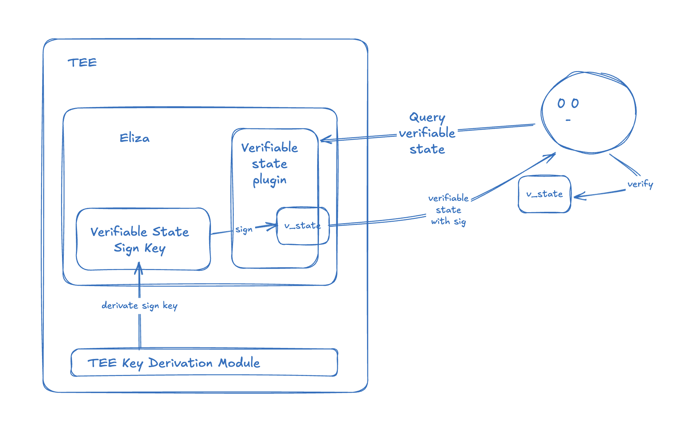

### Motivation

When an AI agent runs inside a TEE, it gains verifiable features, but additional components are needed to expose the agent’s specific runtime state. 

For example, if the AI agent holds a TEE wallet, external parties must be able to verify that wallet. The current implementation may not be scalable, because as AI agent use cases expand, the set of state information requiring verification will also grow. In some scenarios (like those in AI-FI), even more extensive states may need to be verified.

Similar to Verifiable Logs, we aim to define a **Verifiable State** that, through interactive queries, can produce a state object signed by the TEE. External parties can then use the agent’s public key to verify this state. Different application modules can register their own verifiable states via a unified state plugin.

### Procedure

#### Procedure 1: Derive the Verifiable State Signing Key

1. The `v_state` plugin invokes the TEE plugin to generate a key specifically for signing Verifiable States.  
2. That key is stored in a database following the same process used by the Verifiable Log plugin.

#### Procedure 2: User Queries Verifiable State

1. A user calls the Verifiable State query interface, providing the parameters (a namespace and a key) indicating the state they want to retrieve.  
2. Since ElizaOS is extensible, different modules can use different namespaces to register their state values.  
3. The `v_state` plugin uses the namespace to look up a callback function, which then retrieves the state value based on the provided key.  
4. If a state value is found, the plugin returns a `v_state` object containing the AI agent ID, namespace, key, value, timestamp, and signature.

#### Procedure 3: User Verifies the Verifiable State

1. The user needs to obtain the public key via the same attestation interface that the Verifiable Log plugin uses.  
2. Using this public key, the user verifies the `v_state` object. If the signature is valid, it confirms that the state indeed originates from the AI agent.

### Developer Procedure

#### Procedure 1: Register a namespace callback function within the Verifiable State plugin**

1. Integrate the Verifiable State plugin and implement a callback function for a specific namespace.
2. The callback function receives a key value and must return the corresponding value.

**Example**
Suppose there is an AI-FI AI agent that needs external verification of a series of DeFi smart contract addresses it manages. To achieve this, the AI agent can register a namespace called “aifi-module” through the plugin and support queries for states identified by keys like “vault contract address” and “manage contract address,” allowing external parties to verify that these DeFi contracts are indeed managed by the AI agent.

