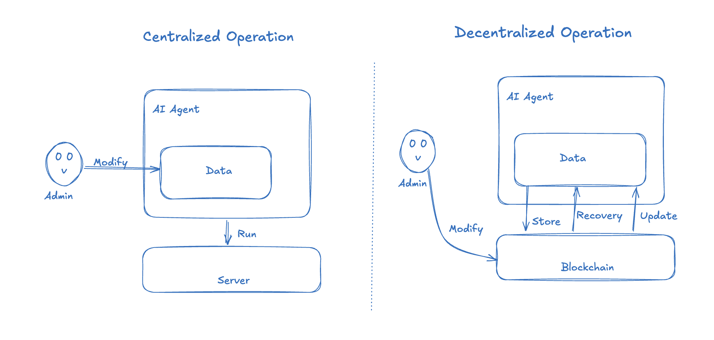

## Overview
Smart contracts operate in a decentralized manner, without a single entity capable of shutting them down, enabling decentralized applications like fund management and DeFi.

For autonomous AI agents managing significant user funds, the presence of a single administrator able to disable them centralizes the funds. By combining TEE and blockchain, autonomous AI agents can operate in a decentralized manner, becoming trustless entities capable of holding funds and executing tasks without administrator intervention, governed solely by their code.

## High-Level Design

The key to achieving decentralized operations is to separate the AI agent’s computation from its data. By storing data on a blockchain or data availability (DA) layer, we ensure decentralized data storage that does not rely on a single server. In addition, computation can be seamlessly transferred across different nodes, preventing dependence on any single physical node.

## Data Classification

AI agent data can be broadly categorized based on its usage and update frequency:

* Character Data 

    Defines the AI agent’s fundamental “character” or domain of expertise (e.g., a medical consultant, financial advisor).
    Typically static once defined, but might be updated through governance in certain scenarios.

* Memory Data
  
    Contains the agent’s historical context, conversation logs, or other knowledge bases.
    Primarily read during operation; changes over time as the agent learns or references past interactions.

* Key Data
    Cryptographic keys (e.g., TEE wallet private keys) crucial for signing transactions and maintaining secure identity.
    Must be stored in encrypted form and handled strictly within a TEE to avoid leaks.
* State Data
    Dynamic configuration fields and operational parameters (e.g., fee rates, service toggles, behavioral flags like “friendly” or “aggressive”). Updated during agent operation or through on-chain governance proposals.

## On-Chain Components

The on-chain design is structured into two levels to handle static and dynamic data, ensuring both high availability and decentralized governance.

### Level 1: On-chain Data Availability

L1 focuses on encrypting and storing static data—such as character information, memory, and key data—on-chain or a data availability layer, ensuring it remains accessible for node recovery.

**Workflow:**

1. **Data Encryption**
   - Character definitions, memory logs, and cryptographic keys are encrypted.
   - The encryption key remains sealed within the TEE so only authorized enclaves can decrypt.
2. **On-Chain/DA Upload**
   - Encrypted data is published to the blockchain or a specialized DA network, guaranteeing permanent and tamper-resistant storage.
   - A reference (e.g., a hash or URI) is stored in a smart contract to allow retrieval by any node that needs to restart the AI agent.
3. **TEE Retrieval and Decryption**
   - When a new node takes over, it fetches the encrypted static data from the blockchain/DA layer.
   - Within the TEE, the data is decrypted and loaded for continuous operations.

### Level 2: On-chain State for State Data

L2 governs dynamic states—like agent configuration or “character” traits—through on-chain governance mechanisms, preventing unauthorized or centralized modifications.

**Workflow:**

1. **Smart Contract State Management**
   - A dedicated contract holds the AI agent’s dynamic fields (e.g., fee rates, personality flags), all modifiable only by on-chain governance rules.
   - Each state variable is mapped to cryptographic references if sensitive, ensuring privacy for off-chain retrieval.
2. **Governance Proposal and Execution**
   - Any update to the AI agent’s behavior (e.g., switching from “friendly” to “aggressive”) requires a governance proposal.
   - The proposal undergoes a consensus-driven process (e.g., DAO voting or multi-signature validation), after which the contract updates the relevant state.
3. **TEE Synchronization**
   - Once updated, the contract emits an event containing the new state data or references.
   - The AI agent (running in a TEE) listens for these events, retrieves the new state, and applies it in real time.
